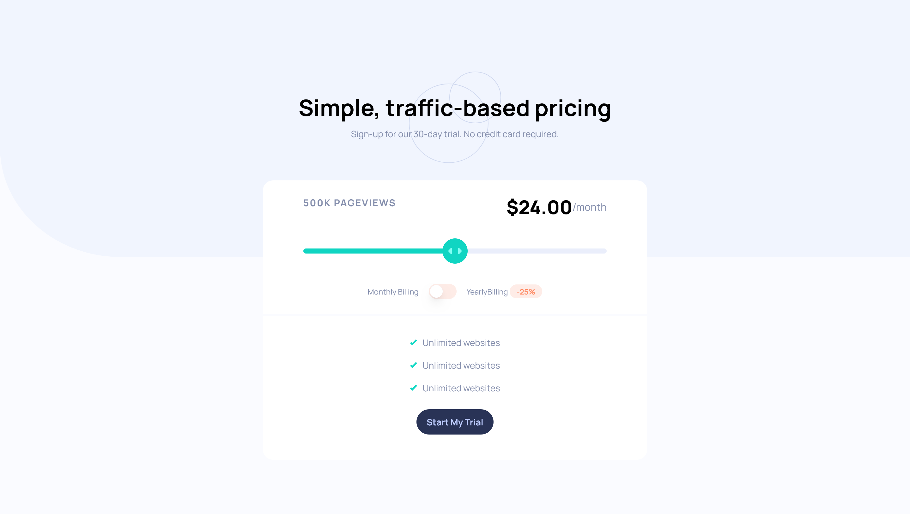
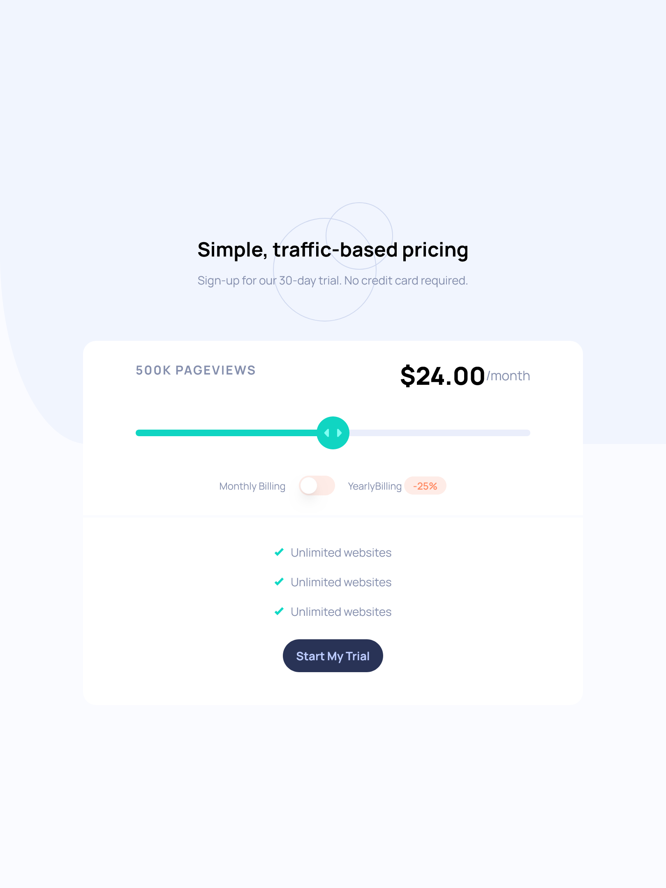

# Frontend Mentor - Interactive pricing component solution

This is a solution to the [Interactive pricing component challenge on Frontend Mentor](https://www.frontendmentor.io/challenges/interactive-pricing-component-t0m8PIyY8). Frontend Mentor challenges help you improve your coding skills by building realistic projects. 

## Table of contents

- [Overview](#overview)
  - [The challenge](#the-challenge)
  - [Screenshot](#screenshot)
  - [Links](#links)
- [My process](#my-process)
  - [Built with](#built-with)
  - [What I learned](#what-i-learned)
  - [Continued development](#continued-development)
- [Author](#author)

## Overview

### The challenge

Users should be able to:

- View the optimal layout for the app depending on their device's screen size
- See hover states for all interactive elements on the page
- Use the slider and toggle to see prices for different page view numbers

### Screenshot

### Links
- Solution URL: [GitHub](https://github.com/humbl3LilaS/interactive_pricing_component.git)
- Live Site URL: [Vercel](https://interactive-pricing-component-swart.vercel.app/)

## My process

### Built with

- Mobile-first workflow
- [React](https://reactjs.org/) - JS library
- [Shadcn](https://ui.shadcn.com/) - UI Library
- Tailwind CSS

### What I learned
- Creating reactive component base on user action
- Bind the action on top of already built UI component not worrying about underlying style of the component
- Utilization of UI framework for more smooth and fast workflow and awesome DX

### Continued development

- I'll start learning and building react app using state management library
- Study more about UI library and underlying concept

## Author
- Frontend Mentor - [@Humble LilaS](https://www.frontendmentor.io/profile/humbl3LilaS)

